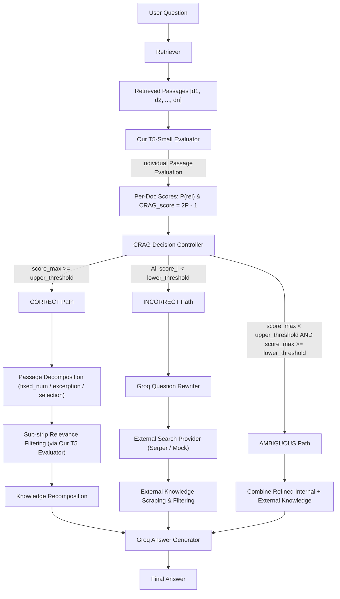

# Corrective Retrieval-Augmented Generation (CRAG) with Custom T5 Evaluator & Groq API

This repository contains a complete, faithful python implementation of the **Corrective Retrieval-Augmented Generation (CRAG)** architecture based on the paper *[Corrective Retrieval Augmented Generation](https://arxiv.org/pdf/2401.15884.pdf)* and reference repository [`HuskyInSalt/CRAG`](https://github.com/HuskyInSalt/CRAG).

---

## Architecture Diagram



---

## Features & Highlights

1. **Custom T5 Retrieval Evaluator Adapter**:
   - Uses supplied fine-tuned `T5ForConditionalGeneration` model (`t5-small`, ~60M parameters).
   - Formats inputs as `evaluate relevance: question: <QUESTION> context: <PASSAGE>`.
   - Computes $P(\text{relevant})$ from decoder logits over target tokens `'1'` and `'0'`.
   - Maps probability to signed CRAG score: $\text{CRAG\_score} = 2P(\text{relevant}) - 1 \in [-1.0, +1.0]$.
2. **Faithful 3-Way Decision Controller**:
   - Executes exact threshold decision boundaries (`CORRECT`, `AMBIGUOUS`, `INCORRECT`).
3. **Groq API Integration**:
   - Powers **Question Rewriting** (`llama-3.1-8b-instant`) and **Final Answer Generation** (`llama-3.3-70b-versatile`).
4. **Complete Observability**:
   - Prints detailed step-by-step logs for query, retrieval, per-passage evaluation, decision, pathway, and final answer.
5. **Experimental Comparison Suite**:
   - Runs side-by-side evaluation of Vanilla RAG vs. CRAG.

---

## Installation & Setup

```bash
# 1. Install dependencies
pip install -r requirements.txt

# 2. Configure Environment Variables (or copy .env.example)
cp .env.example .env
```

---

## Quick Usage

### Run Single Query with Full Observability Trace
```bash
python -m crag_custom.scripts.run_crag --query "What is George Rankin's occupation?"
```

### Run Experimental Comparison (Vanilla RAG vs. CRAG)
```bash
python -m crag_custom.scripts.run_experiments
```

### Run Unit & Integration Tests
```bash
pytest crag_custom/tests/
```
